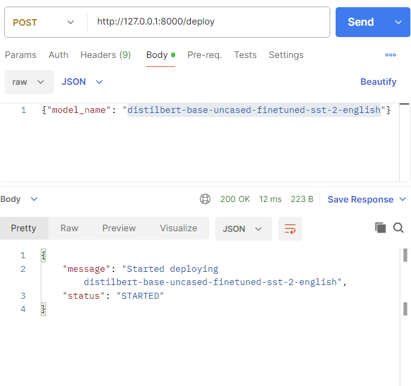
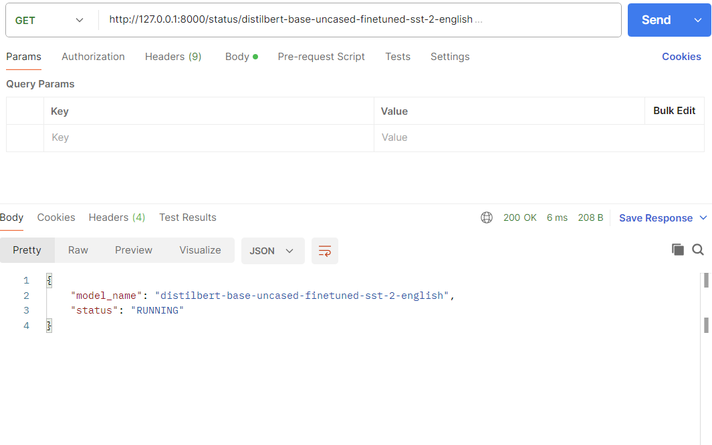
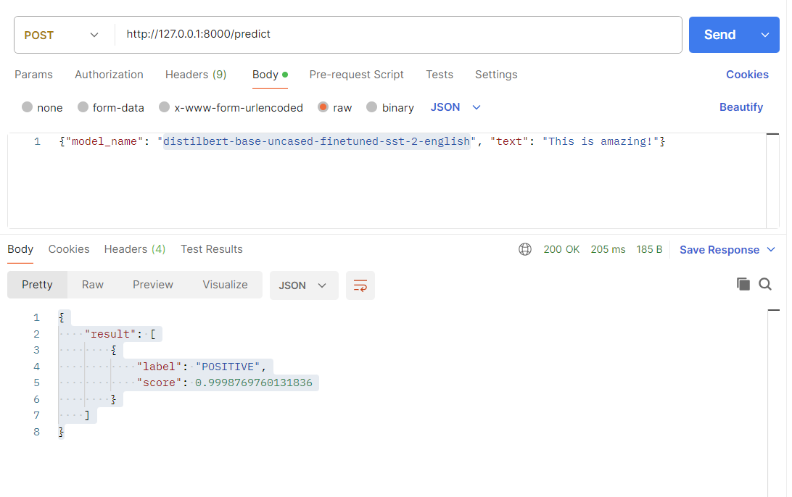
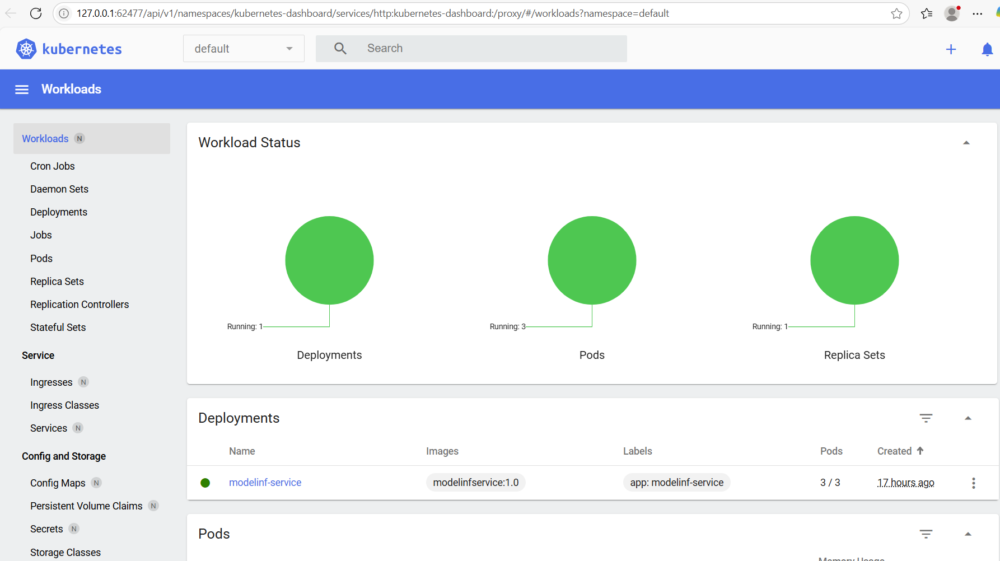

# TBI-assessment_repo

## GitHub
https://github.com/saniya-afreen/TBI-assessment_repo/tree/main

## Introduction
This project has 3 major sections iac, serving, tests
The basic idea of this projectis to deploy serving APIs using terraform on a k8s Cluster. Using GithUB actions, I demonstrated CI/CD pipeline implementation. Whenever the developer pushed the code, the github action will trigger and using the terrform configuration it will deploy the whole application in one git push.

- iac
- serving
- tests
- Dockerfile
- .gitignore
- GitHub Action - https://github.com/saniya-afreen/TBI-assessment_repo/actions

## iac -> Infrastructure as code using terraform on K8s cluster

The files under it are written for the following reason:

- main.tf: 	Core Terraform configuration that sets up the Kubernetes provider, applies deployment and service templates, and creates Kubernetes resources.
- variables.tf: Declares configurable input variables in this case the docker image for flexibility and reuse.
- outputs.tf:	Outputs the service URL by dynamically fetching the Minikube IP and combining it with the exposed NodePort.
- k8s_deployment.yaml.tpl:	A templated Kubernetes Deployment manifest that is rendered by Terraform using variables for dynamic configuration.
- k8s_service.yaml.tpl:	A templated Kubernetes Service manifest (usually a NodePort) to expose the FastAPI application outside the cluster.

## tests -> test cases to test the APIs in serving

## serving
serving -> requirement.txt, apis to deploy and check status of the 
APIs:
Signature of this API is mentioned below in the test section.
#### POST /deploy
This API takes model_name as input, and deploys the given HuggingFace model, also return the status of the running model

#### GET /status
This API gives the status of the last deployed model.

#### POST /predict
This API is to perfrom inference on the deployed model, it takes the model name and required parameters. 
For this example, I have used distilbert-base-uncased-finetuned-sst-2-english model, that takes single sentence and returns positivity/negativity of the sentence.

# model-app Build and test
Deploy model using K8, terraform:

Before deploying the model for setting up the environment :
1. Build the docker image of our model-app serving module
>  docker build -t model-app-serving:latest .

2. Running terraform
> cd iac/
> terraform init
> terraform apply

3. Exposing URL
terraform output node_port_url

4. Test the API
#### 4.1. Deploy

- API Details:
> curl --location 'http://127.0.0.1:8000/deploy' \
--header 'Content-Type: application/json' \
--data '{"model_name": "distilbert-base-uncased-finetuned-sst-2-english"}'

- Response:
{
    "message": "Started deploying sentence-transformers/all-MiniLM-L6-v2",
    "status": "STARTED"
}

#### 4.2. Status

- API Details:

curl --location --request GET 'http://127.0.0.1:8000/status/all-MiniLM-L6-v2all-MiniLM-L6-v2' \
--header 'Content-Type: application/json' \
--data '{"model_name": "distilbert-base-uncased-finetuned-sst-2-english"}'

- Response:
- Positive:
{
    "model_name": "distilbert-base-uncased-finetuned-sst-2-english",
    "status": "RUNNING"
}
- Negative:
{
    "model_name": "all-MiniLM-L6-v2all-MiniLM-L6-v2",
    "status": "NOT_SERVING"
}

#### 4.3. Test the Deployed Model - Predict

- API Details:

curl --location 'http://127.0.0.1:8000/predict' \
--header 'Content-Type: application/json' \
--data '{"model_name": "distilbert-base-uncased-finetuned-sst-2-english", "text": "This is amazing!"}'

- Response:
{
    "result": [
        {
            "label": "POSITIVE",
            "score": 0.9998769760131836
        }
    ]
}

## Monitoring
For simplicity of the task, I am using minikube dashboard to monitor the application, a proper grafana/prometheus dashboard can be implemented to proivde more richer information, such as request counts and pod health.

- For this project I am using 
> minikube dashboard

- minikube dashboad - http://127.0.0.1:53020/api/v1/namespaces/kubernetes-dashboard/services/http:kubernetes-dashboard:/proxy/#/workloads?namespace=default

- Here's an example screenshot of similar model app running on K8s

### Dependencies 
I have kept all out dependencies inside the requirements.txt (will already run in docker image creation):

Dependencies used:

fastapi – the main framework I used to build the API.

uvicorn – runs the FastAPI app (it's the server).

python-multipart – helps handle file uploads (like images).

pillow – used for image processing.

torch – PyTorch, for running ML models.

torchvision – has some handy tools and models for computer vision stuff.

pytest – Python test framework for running tests easily.

httpx – HTTP client to send requests to FastAPI during tests.

These are all the packages I needed to get the backend, file uploads, and ML model working together.1.

#### Quick Steps to Test the Project
1. Build Docker Image

docker build -t model-app-serving:latest .
 
 2. Deploy with Terraform

cd iac/
terraform init
terraform apply 

3. Deploy a Model

bash

curl -X POST <SERVICE_URL>/deploy \
 -H "Content-Type: application/json" \
 -d '{"model_name": "distilbert-base-uncased-finetuned-sst-2-english"}'

4. Check Model Status

curl -X GET <SERVICE_URL>/status/distilbert-base-uncased-finetuned-sst-2-english

5. Make a Prediction
 
curl -X POST <SERVICE_URL>/predict \
 -H "Content-Type: application/json" \
 -d '{"model_name": "distilbert-base-uncased-finetuned-sst-2-english", "text": "This is amazing!"}'
